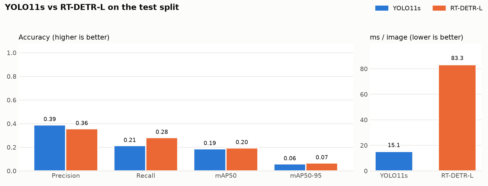
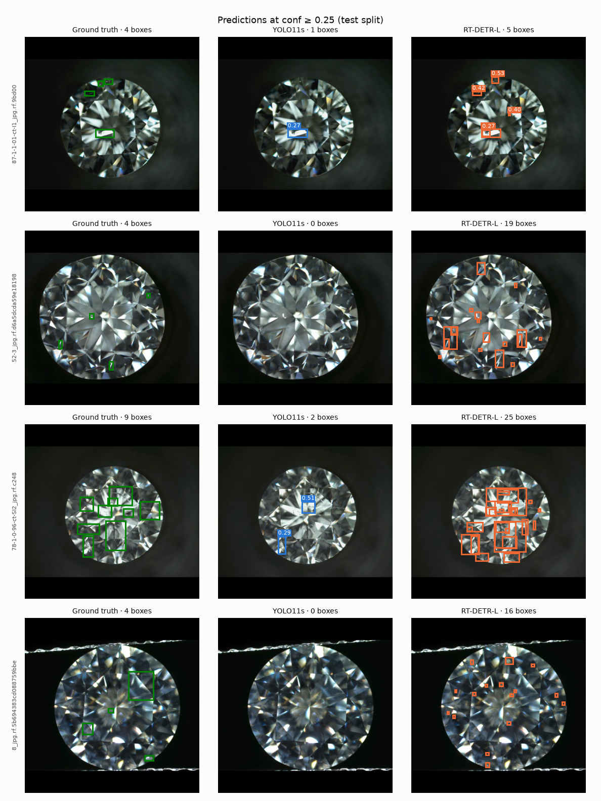
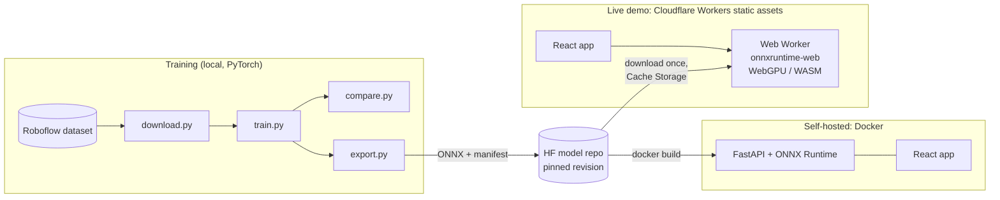

# GemScan: gemstone inclusion detection

[](https://github.com/flupxscop/gem-defect-detection/actions/workflows/ci.yml)
[](https://gemscan.nanthawatchan28.workers.dev)
[](https://huggingface.co/ChantaroNtw/gemscan-models)
[](LICENSE)

Detects inclusions (internal flaws) in diamond photos and compares two detector families trained under the
same settings: **YOLO11s** (CNN) and **RT-DETR-L** (transformer). The project covers the full path from a
labelled dataset to a deployed web app: data preparation, training, evaluation, ONNX export, in-browser
inference with WebGPU, a FastAPI service for self-hosting, CI, and free hosting on Cloudflare.

**Live demo:** https://gemscan.nanthawatchan28.workers.dev
([mirror on Hugging Face](https://chantarontw-gemscan.static.hf.space)). The models run on your device, so
photos never leave the browser.



## Results

Test split: 16 images, 117 inclusions. Trained on an Apple M2 (8 GB) with identical hyperparameters
(60 epochs, 640 px, COCO-pretrained, seed 0, early stopping patience 20).

| Model | Precision | Recall | mAP50 | mAP50-95 | Training time |
|---|---:|---:|---:|---:|---:|
| YOLO11s | **0.390** | 0.213 | 0.187 | 0.059 | 33 min |
| RT-DETR-L | 0.357 | **0.282** | **0.195** | **0.067** | 3.5 h (early-stopped at epoch 53) |

**Recommendation: RT-DETR-L.** In quality control a missed inclusion costs more than a false alarm, so recall
is the deciding metric (ties within 0.02 go to the faster model). RT-DETR-L finds about a third more inclusions.
YOLO11s is about 4.5× faster on CPU and slightly more precise, so it is the better fit when throughput matters
more than catch rate.

Both models are far from production quality. The dataset has only 116 training images and most inclusions are
tiny: the median box is 16 px on its short side at 640 px, and about 23% are under 8 px. YOLO11s was still
improving at epoch 60, so a longer schedule would likely narrow the gap.

### Where the models fail



Ground truth (green), YOLO11s (blue) and RT-DETR-L (orange) at confidence ≥ 0.25:

1. **Missed small inclusions (YOLO11s).** In rows 2 and 4 YOLO11s finds none of the four labelled inclusions.
2. **Facet reflections detected as inclusions (RT-DETR-L).** Row 2 has 4 real inclusions and 19 predicted
   boxes; bright facet edges are the main source of false positives.
3. **Noisy labels.** Some ground-truth boxes overlap or group several flaws into one box (row 3), which caps
   the precision any model can reach on this data.

## Performance

Full methodology, raw tables and rejected optimisations are in [docs/benchmarks.md](docs/benchmarks.md).
All numbers were measured on an Apple M2 (8 GB).

**In the browser (live demo)**

| | WebGPU | WASM fallback |
|---|---:|---:|
| YOLO11s per image | 62 ms | 174 ms |
| RT-DETR-L per image | 236 ms | 770 ms |
| Page interactive / first model ready (first visit) | 0.36 s / 5.9 s | |
| Both models ready, return visit (cached) | 4.8 s | |

**Self-hosted server (Docker, limited to 2 CPUs)**

| | YOLO11s | RT-DETR-L |
|---|---:|---:|
| p50 / p99 latency, one client | 146 / 176 ms | 639 / 752 ms |
| Throughput | 6.8 req/s | 1.6 req/s |
| Cold start (both models loaded and warmed) | 2.4 s | |
| Memory, idle → under load | 430 → 683 MB | |

Three implementations of the same pipeline agree box for box. The Python server matches Ultralytics on all
1,641 detections across 98 images (`scripts/check_parity.py`), the browser matches the server on WebGPU and
WASM, and unit tests pin the TypeScript port to fixtures generated from the Python code.

## Architecture



- **Inference in the browser.** The live demo is a static site on Cloudflare. A Web Worker loads the ONNX models with
  onnxruntime-web and runs them on WebGPU, falling back to multi-threaded WASM. Hosting costs nothing, there is
  no server to scale or wake up, and uploaded photos stay on the device.
- **Model registry.** Weights live in a Hugging Face model repo, not in Git. The web app and the Docker build
  both load them from a pinned commit, so every deployment knows exactly which models it serves.
- **Same pipeline in two languages.** Pre- and post-processing (OpenCV-style bilinear resize, letterbox, NMS,
  RT-DETR decoding) exist in Python (`app/inference.py`) and TypeScript (`web/src/detect`), kept equal by
  fixture tests.
- **Self-hosting.** The Docker image serves the same front end in server mode (`VITE_INFERENCE=server`) with a
  FastAPI API. It runs one inference at a time on all CPUs the container is allowed (read from the cgroup quota),
  queues up to 16 requests, and returns `503` with `Retry-After` beyond that.

## Quick start

Front end only, with models running in the browser:

```bash
cd web && npm install && npm run dev    # http://localhost:5173
```

Self-hosted server with the same UI:

```bash
docker build -t gemscan .               # downloads the models from the model repo
docker run -p 7860:7860 gemscan         # http://localhost:7860
```

Server development with hot reload:

```bash
python -m venv .venv && source .venv/bin/activate
pip install -r requirements-dev.txt
python scripts/fetch_models.py
uvicorn app.main:app --reload --port 8000
cd web && VITE_INFERENCE=server npm run dev    # proxies /api to :8000
```

The checks CI runs:

```bash
ruff check . && ruff format --check . && pytest
cd web && npm test && npm run build
```

## Reproducing the models

```bash
pip install -r requirements-train.txt
cp .env.example .env                    # Roboflow API key, workspace, project, version

python src/download.py                  # YOLO-format dataset in data/dataset, Inclusion class only
python src/train.py --model yolo11s
python src/train.py --model rtdetr-l    # slow on a laptop; consider a free Colab GPU
python src/compare.py                   # metrics and charts in results/
python src/export.py                    # ONNX + manifest in models/
python scripts/check_parity.py          # server pipeline vs Ultralytics
```

`train.py` lowers the batch size automatically on machines with less than 12 GB of RAM (YOLO11s 16 → 4,
RT-DETR-L 4 → 2), because batch 16 at 640 px fills an 8 GB Mac's shared memory and training stalls in swap.

## Deployment

Free tiers only: Cloudflare for the site, Hugging Face for the model repo, GitHub for code and CI.

```bash
huggingface-cli login
python scripts/publish_models.py --repo <user>/gemscan-models    # prints the commit to pin
# set that commit as MODEL_REVISION in web/src/config.ts

cd web
npx wrangler login
npm run deploy:cloudflare
```

`web/wrangler.jsonc` deploys `dist/` as Workers static assets, and `web/public/_headers` adds the COOP/COEP
headers that let WASM use multiple threads. Cloudflare caps files at 25 MiB and onnxruntime-web's WebGPU runtime
is 25.5 MiB, so the Cloudflare build fetches that one file from jsDelivr (the same npm package, pinned version)
and caches it like the models. Model downloads are sent without a `Referer` because huggingface.co rejects
requests referred from `*.workers.dev`.

The same build also runs on a free Hugging Face static Space: `npm run build` in `web/`, then
`python scripts/deploy_space.py --space <user>/gemscan`. Hugging Face Docker Spaces need a paid plan, which is
why the demo runs the models client-side; the Docker image is for self-hosting on any container platform.

## API (self-hosted server)

| Method | Path | Description |
|---|---|---|
| GET | `/api/health` | `{"status": "ok", "models": [...]}` |
| GET | `/api/models` | Model metadata and test-split metrics |
| POST | `/api/predict` | Multipart `file` (JPG/PNG/WEBP, ≤ 10 MB), `model` = `yolo11s` / `rtdetr-l` / `both`, `conf` 0–1 |
| GET | `/api/docs` | OpenAPI UI |

```bash
curl -F file=@stone.jpg -F model=both http://localhost:7860/api/predict
```

```json
[
  {
    "model": "yolo11s",
    "inference_ms": 141.2,
    "image": {"width": 640, "height": 640},
    "detections": [{"class": "Inclusion", "confidence": 0.51, "box": [301.5, 210.0, 330.2, 248.9]}]
  }
]
```

Boxes are `[x1, y1, x2, y2]` in the pixels of the uploaded image after EXIF rotation. Each response carries a
`Server-Timing` header with decode and per-model inference time. Errors: `413` file too large, `415`
unsupported or unreadable file, `422` invalid `model` or `conf`, `503` model unavailable or server busy.

## Project structure

```
app/            FastAPI service: inference.py (ONNX detectors), main.py (routes), settings.py (env config)
src/            Training pipeline: download, train, compare, export
scripts/        check_parity, benchmark, fetch_models, publish_models, deploy_space
web/            React + TypeScript + Vite front end; web/src/detect runs the models in a Web Worker
tests/          API, inference, settings and data-preparation tests (web tests live next to the code)
results/        Evaluation outputs (committed)
docs/           Benchmarks
```

Runtime settings are environment variables: `MODELS_DIR`, `ORT_THREADS`, `MAX_CONCURRENCY`, `MAX_QUEUE`,
`MAX_UPLOAD_MB` and `CORS_ORIGINS` (see `app/settings.py`).

## Data and license

Code is MIT-licensed. The models are trained on
[Diamond Inclusion](https://universe.roboflow.com/diamond-classification-data/diamond-inclusion) by Diamond
Classification Data (165 images, [CC BY 4.0](https://creativecommons.org/licenses/by/4.0/)); the published
weights and the four sample images in `web/public/samples` carry the same license.

- Roboflow version: auto-orient, resize to 640×640 (fit with black edges), split 70/20/10, no augmentation
  (Ultralytics augments during training).
- The source labels the whole stone as `Diamond` as well as each `Inclusion`. `download.py` keeps only
  `Inclusion` by default, since large stone boxes are easy and would inflate recall and mAP; pass
  `--classes all` to keep both. Polygon labels are converted to bounding boxes.

## Limitations

- Small dataset: metrics on a 16-image test split vary noticeably between runs.
- Detection only. No clarity grading on the GIA scale and no inspection of metal settings.
- The first visit downloads 169 MB of models; RT-DETR-L is heavy for low-end phones, where YOLO11s is the
  practical choice.

## Roadmap

- Two-stage pipeline: locate the stone, then detect inclusions on a high-resolution crop.
- Longer training schedule and tiling for very small inclusions.
- Core ML export for on-device inference.
