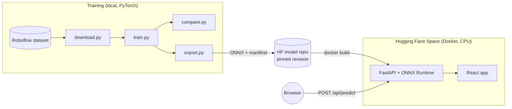

# GemScan: gemstone inclusion detection

[](https://github.com/GITHUB_REPO/actions/workflows/ci.yml)
[](https://huggingface.co/spaces/ChantaroNtw/gemscan)
[](https://huggingface.co/ChantaroNtw/gemscan-models)
[](LICENSE)

Detects inclusions (internal flaws) in diamond photos and compares two detector families trained under the
same settings: **YOLO11s** (CNN) and **RT-DETR-L** (transformer). The project covers the full path from a
labelled dataset to a deployed web app: data preparation, training, evaluation, ONNX export, a FastAPI
inference service, a React front end, CI, and a free deployment on Hugging Face Spaces.

**Live demo:** https://chantarontw-gemscan.hf.space


## Results

Test split: 16 images, 117 inclusions. Trained on an Apple M2 (8 GB) with identical hyperparameters
(60 epochs, 640 px, COCO-pretrained, seed 0, early stopping patience 20).

| Model | Precision | Recall | mAP50 | mAP50-95 | Training time |
|---|---:|---:|---:|---:|---:|
| YOLO11s | **0.390** | 0.213 | 0.187 | 0.059 | 33 min |
| RT-DETR-L | 0.357 | **0.282** | **0.195** | **0.067** | 3.5 h (early-stopped at epoch 53) |

**Recommendation: RT-DETR-L.** In quality control a missed inclusion costs more than a false alarm, so recall
is the deciding metric (ties within 0.02 go to the faster model). RT-DETR-L finds about a third more inclusions.
YOLO11s is about 4.5× faster on CPU and slightly more precise, so it is the better fit when throughput matters
more than catch rate.

Both models are far from production quality. The dataset has only 116 training images and most inclusions are
tiny: the median box is 16 px on its short side at 640 px, and about 23% are under 8 px. YOLO11s was still
improving at epoch 60, so a longer schedule would likely narrow the gap.

### Where the models fail


Ground truth (green), YOLO11s (blue) and RT-DETR-L (orange) at confidence ≥ 0.25:

1. **Missed small inclusions (YOLO11s).** In rows 2 and 4 YOLO11s finds none of the four labelled inclusions.
2. **Facet reflections detected as inclusions (RT-DETR-L).** Row 2 has 4 real inclusions and 19 predicted
   boxes; bright facet edges are the main source of false positives.
3. **Noisy labels.** Some ground-truth boxes overlap or group several flaws into one box (row 3), which caps
   the precision any model can reach on this data.

## Serving performance

Full methodology, raw tables and rejected optimisations are in [docs/benchmarks.md](docs/benchmarks.md).

PERF_SUMMARY

| Footprint (local container, 2 CPUs) | |
|---|---|
| Cold start (container start → healthy, models warmed) | 2.4 s |
| Memory, idle → under load | 430 → 683 MB |
| Image dependencies | 291 MB, no PyTorch |

The server runs the exported ONNX models with plain numpy/OpenCV pre- and post-processing. Against Ultralytics
running the same ONNX files it reproduces all 1,641 detections across 98 test and validation images
(`scripts/check_parity.py`). Compared with serving the PyTorch weights it starts 2.4× faster and uses half the
memory.

## Architecture



- **Model registry.** Weights live in a Hugging Face model repo, not in Git. The Docker build downloads them
  from a pinned commit (`MODEL_REVISION`), so a deployment always knows exactly which models it serves.
- **One container.** FastAPI serves both the API (`/api/*`) and the built front end, so there is a single URL
  and no CORS in production.
- **Bounded work.** One inference runs at a time using all cores, up to 16 requests queue, and anything beyond
  that gets `503` with `Retry-After`.

## Quick start

Run the app in Docker (the build downloads the models):

```bash
docker build -t gemscan .
docker run -p 7860:7860 gemscan
# open http://localhost:7860
```

Develop with hot reload:

```bash
python -m venv .venv && source .venv/bin/activate
pip install -r requirements-dev.txt
python scripts/fetch_models.py          # or export your own, see below
uvicorn app.main:app --reload --port 8000

cd web && npm install && npm run dev    # http://localhost:5173, proxies /api to :8000
```

The checks CI runs:

```bash
ruff check . && ruff format --check . && pytest
```

## Reproducing the models

```bash
pip install -r requirements-train.txt
cp .env.example .env                    # Roboflow API key, workspace, project, version

python src/download.py                  # YOLO-format dataset in data/dataset, Inclusion class only
python src/train.py --model yolo11s
python src/train.py --model rtdetr-l    # slow on a laptop; consider a free Colab GPU
python src/compare.py                   # metrics and charts in results/
python src/export.py                    # ONNX + manifest in models/
python scripts/check_parity.py          # server pipeline vs Ultralytics
```

`train.py` lowers the batch size automatically on machines with less than 12 GB of RAM (YOLO11s 16 → 4,
RT-DETR-L 4 → 2), because batch 16 at 640 px fills an 8 GB Mac's shared memory and training stalls in swap.

## Deployment

Everything runs on free tiers: GitHub for code and CI, Hugging Face for the model repo and the Space
(2 vCPU, 16 GB RAM).

```bash
huggingface-cli login
python scripts/publish_models.py --repo <user>/gemscan-models      # prints MODEL_REVISION
python scripts/deploy_space.py --space <user>/gemscan \
    --model-repo <user>/gemscan-models --revision <MODEL_REVISION>
```

Free Spaces sleep after 48 hours without traffic, and the first visit afterwards takes about a minute while the
container starts. The front end shows a "waking up" message and retries on its own.

## API

| Method | Path | Description |
|---|---|---|
| GET | `/api/health` | `{"status": "ok", "models": [...]}` |
| GET | `/api/models` | Model metadata and test-split metrics |
| POST | `/api/predict` | Multipart `file` (JPG/PNG/WEBP, ≤ 10 MB), `model` = `yolo11s` / `rtdetr-l` / `both`, `conf` 0–1 |
| GET | `/api/docs` | OpenAPI UI |

```bash
curl -F file=@stone.jpg -F model=both https://chantarontw-gemscan.hf.space/api/predict
```

```json
[
  {
    "model": "yolo11s",
    "inference_ms": 141.2,
    "image": {"width": 640, "height": 640},
    "detections": [{"class": "Inclusion", "confidence": 0.51, "box": [301.5, 210.0, 330.2, 248.9]}]
  }
]
```

Boxes are `[x1, y1, x2, y2]` in the pixels of the uploaded image after EXIF rotation. Each response carries a
`Server-Timing` header with decode and per-model inference time. Errors: `413` file too large, `415`
unsupported or unreadable file, `422` invalid `model` or `conf`, `503` model unavailable or server busy.

## Project structure

```
app/            FastAPI service: inference.py (ONNX detectors), main.py (routes), settings.py (env config)
src/            Training pipeline: download, train, compare, export
scripts/        check_parity, benchmark, fetch_models, publish_models, deploy_space
web/            React + TypeScript + Vite front end
tests/          API, inference and data-preparation tests
results/        Evaluation outputs (committed)
docs/           Benchmarks
```

Runtime settings are environment variables: `MODELS_DIR`, `ORT_THREADS`, `MAX_CONCURRENCY`, `MAX_QUEUE`,
`MAX_UPLOAD_MB` and `CORS_ORIGINS` (see `app/settings.py`).

## Data and license

Code is MIT-licensed. The models are trained on
[Diamond Inclusion](https://universe.roboflow.com/diamond-classification-data/diamond-inclusion) by Diamond
Classification Data (165 images, [CC BY 4.0](https://creativecommons.org/licenses/by/4.0/)); the published
weights and the four sample images in `web/public/samples` carry the same license.

- Roboflow version: auto-orient, resize to 640×640 (fit with black edges), split 70/20/10, no augmentation
  (Ultralytics augments during training).
- The source labels the whole stone as `Diamond` as well as each `Inclusion`. `download.py` keeps only
  `Inclusion` by default, since large stone boxes are easy and would inflate recall and mAP; pass
  `--classes all` to keep both. Polygon labels are converted to bounding boxes.

## Limitations

- Small dataset: metrics on a 16-image test split vary noticeably between runs.
- Detection only. No clarity grading on the GIA scale and no inspection of metal settings.
- Inference is CPU-only on the free tier; RT-DETR-L takes about half a second per image.

## Roadmap

- Two-stage pipeline: locate the stone, then detect inclusions on a high-resolution crop.
- Longer training schedule and tiling for very small inclusions.
- Core ML export for on-device inference.
